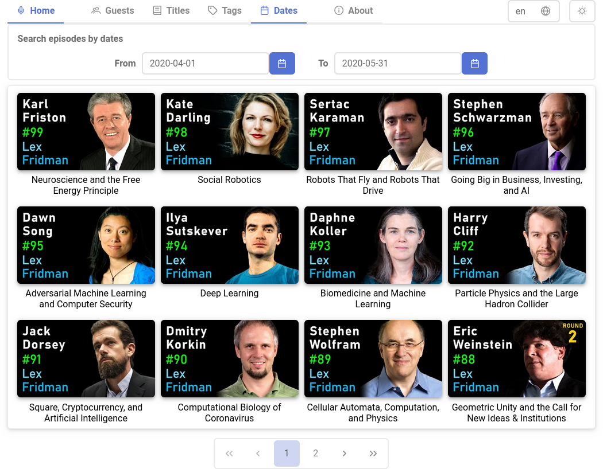

[](https://github.com/jldblog/lfpe/actions/workflows/update-db.yml)
[](https://github.com/jldblog/lfpe/actions/workflows/gh-pages.yml)
[](https://www.gnu.org/licenses/gpl-3.0)

<table align="center">
  <tr>
    <td>
      <p align="center">
        
      </p>
    </td>
    <td>
      <p align="right" width="100%">
      <i>
      Dr Aronnax, answered Captain Nemo,<br/>
      my electricity is not the commonly used sort,<br/>
      and that is all I wish to say on the matter.<br/>
      </i>
      <br/>
      Jules Verne, Twenty Thousand Leagues under the Sea<br/>
      Chapitre XII — 1869 (translation by William Butcher)
      </p>
    </td>
  </tr>
</table>

# Lex Fridman Podcast — Episodes Explorer

<p align="center">
  
  <br/>
  <b><a href="https://jldblog.github.io/lfpe/" target="_blank">https://jldblog.github.io/lfpe/</a></b>
</p>

**Lex Fridman Podcast — Episodes Explorer** is an application that allows you to search for episodes (by guests, titles, tags & dates) in the
<a href="https://lexfridman.com/podcast/" target="_blank">Lex Fridman Podcast</a>.

Note: this project is not related to Lex Fridman.

### Demo

The online demo of this project on GitHub is here : **<a href="https://jldblog.github.io/lfpe/" target="_blank">https://jldblog.github.io/lfpe/</a>**

### Gallery

#### Home — Most viewed episodes

<p align="center">

</p>

#### Search episodes by guests

<p align="center">

</p>

#### Search episodes by titles

<p align="center">

</p>

#### Search episodes by dates

<p align="center">

</p>

#### Episode description

<p align="center">

</p>

#### On a smartphone (dark mode)

<table align="center">
  <tr>
    <td>
      
    </td>
    <td>
      
    </td>
  </tr>
</table>

### How to build

#### 1. Prerequisites

We assume that <a href="https://nodejs.org/en/download" target="_blank">Node.js 18+</a> and <a href="https://angular.io/guide/setup-local" target="_blank">Angular 16</a> are installed.

#### 2. Installation

```shell
git clone https://github.com/jldblog/lfpe.git
cd lfpe
npm install
```

And for running the script `src/scripts/generate-db.ts` we also need:

```shell
npm install -g ts-node
```

#### 3. Database generation

The script `src/scripts/generate-db.ts` uses the <a href="https://developers.google.com/youtube/v3" target="_blank">Youtube Data API v3</a>.\
<b>You must create a Youtube API key</b>, see how to do this on <a href="https://developers.google.com/youtube/registering_an_application" target="_blank">Obtaining authorization credentials</a> or on this <a href="https://blog.hubspot.com/website/how-to-get-youtube-api-key" target="_blank">tutorial with examples</a>.

```shell
export YOUTUBE_API_KEY=your-youtube-api-key-here
```

And now you can run the script with this command (as defined in `package.json`);

```shell
npm run generatedb
```

You should obtain something like:

```text
> lfpe@1.0 generatedb
> ts-node-esm --transpile-only src/scripts/generate-db.ts

Found video: fUEjCXpOjPY
Found video: aGOV5R7M1Js
Found video: XbPHojL_61U
...
...
Add episode: 3
Add episode: 2
Add episode: 1
395 episodes found
Saved src/assets/db.json
```

_Note (with a profound mathematical consideration):_

- _#84 episode is private, see <a href="https://www.reddit.com/r/lexfridman/comments/zmfznv/request_for_lex_to_make_a_public_statement_on_the/" target="_blank">here</a> why._
- _#100 episode is <a href="https://www.youtube.com/watch?v=6I5I56uVvLw" target="_blank">on another channel</a>, but we added it in `generate-db.ts`._
- _So it is normal if the script found for example 395 episodes even if the current last episode is #396 !_

#### 4. Running the live development server

```shell
ng serve
...
...
Angular Live Development Server is listening on localhost:4200, open your browser on http://localhost:4200/
```

### Related links

- Demo : https://jldblog.github.io/lfpe/
- <a href="https://lexfridman.com/" target="_blank">Lex Fridman Web Site</a> & <a href="https://www.youtube.com/lexfridman" target="_blank">Lex Fridman Channel on YouTube</a>
- <a href="https://jldblog.eu/" target="_blank">My blog (in French)</a>
- To finish, a nod to the project that gave me the idea to develop this application : <a href="https://agadmator-library.github.io/" target="_blank">agadmator-library</a>
